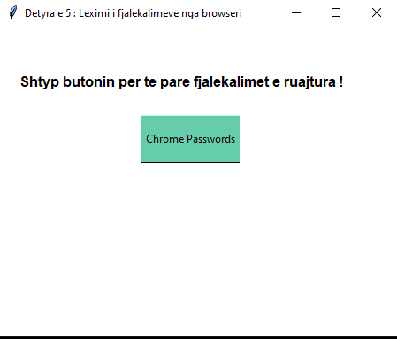
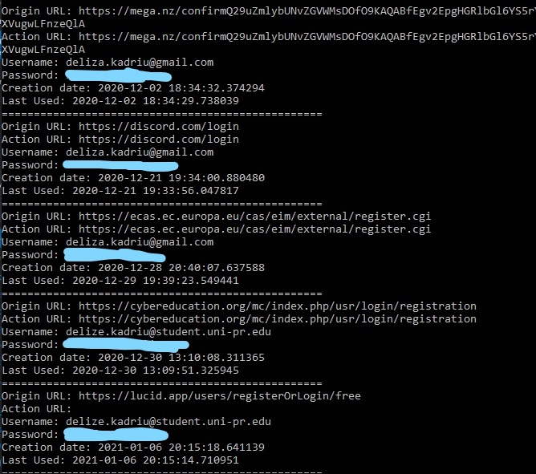
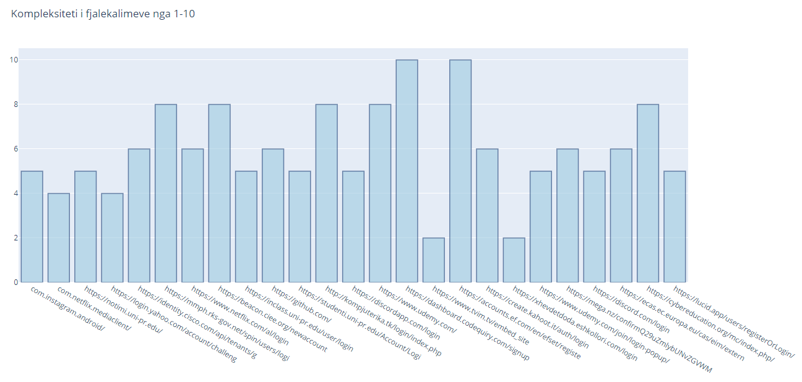

# Siguria ne Internet  
### Faza e trete e projektit: Leximi i Fjalekalimeve

#### Detyra numer 5

Zhvillimi i aplikacionit qe lexon passwordet e ruajtur ne browseret klasik (IE, Chrome, Mozilla) dhe
vizuelizon kompleksitetin ne forme grafi duke marre parasysh disa kritere.

#### Hyrja 

Aplikacioni ka per qellim marrjen e informacioneve nga browseri i zgjedhur ku bene paraqitjen e url-s te faqes, username-in dhe password-in. Ne e kemi marrur path-in ku jane ruajtur informacionet e Google Chrome. Implementimi eshte bere ne gjuhen programuese Python duke perdorur modulin Tkinter.

#### Hapat per Ekzekutim

Kur bejm ekzekutimit e programit na shfaqet pamja ne vazhdim

Pasi qe te shtypim butonin Chrome Passwords do te shfaqen ne terminal fjalekalimet bashk me linkun e url dhe emrin e perdoruesit. Gjithashtu do te hapet faqja html ku eshte paraqitur grafiku i kompleksitetit te fjalekalimeve.

### Paraqitja Grafike 

Per paraqitje grafike kemi perdorur modulin plotly.
Vlera 1 ne graf paraqet kompleksitetin me te vogel kurse vlera 10 kompleksitetin me te madh. Si kriteri kemi marr parasysh gjatesin e fjalekalimit, perdorimin e shkronjave te medha dhe te vogla, perdorimi i numrave dhe perdorimi i simboleve speciale.

